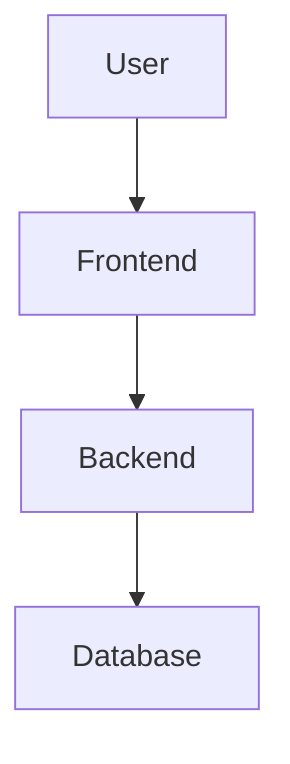

# High-Level Design Document for ShareRecipe

## Introduction
ShareRecipe is a platform for finding recipes based on available ingredients. The goal is to simplify meal preparation for users with limited time and resources. This document outlines the architecture and major components of the system.

---

## Architecture Overview
The ShareRecipe system is built on a client-server model with the following layers:
1. **Frontend (React + TypeScript)**:
   - User interface for searching and displaying recipes.
   - Input forms for adding personal recipes.
   - Interfaces for recipe ratings and reviews.

2. **Backend (Express.js)**:
   - RESTful APIs to handle user requests.
   - Database communication for storing and retrieving data.
   - Middleware for user authentication and input validation.

3. **Database (MySQL or MongoDB)**:
   - Stores recipe details, user data, and reviews.
   - Optimized with indexes for efficient searches.

4. **External Libraries**:
   - `bcrypt` for password hashing.
   - `jsonwebtoken` for user authentication.
   - `Axios` for API calls between frontend and backend.

---

## Component Breakdown
### Frontend
- **Main Components**:
  - `SearchBar`: Handles user input for searching recipes.
  - `RecipeList`: Displays a list of recipes.
  - `RecipeDetails`: Shows detailed recipe instructions and ratings.
  - `UserAccount`: Manages user profiles and saved recipes.

### Backend
- **API Endpoints**:
  - `/recipes/search`: Returns recipes matching ingredients.
  - `/recipes/:id`: Fetches details of a specific recipe.
  - `/users/register`: Handles new user registration.
  - `/users/login`: Authenticates users.
- **Middleware**:
  - `authMiddleware`: Ensures protected routes are accessed by authenticated users only.

---

## Diagrams
### 1. **System Architecture**

### 2. ** Frontend Component Hierarchy

graph TD
Root --> SearchBar
Root --> RecipeList
Root --> RecipeDetails
Root --> UserAccount

### 3. **

sequenceDiagram
User->>Frontend: Search query
Frontend->>Backend: GET /recipes/search
Backend->>Database: SQL Query
Database->>Backend: Recipe Data
Backend->>Frontend: Recipe JSON
Frontend->>User: Display results
