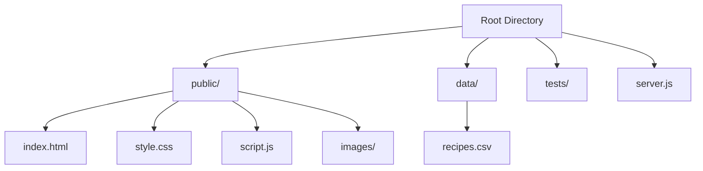
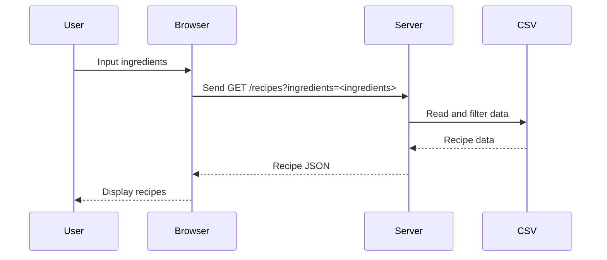

# High-Level Design Document for ShareRecipe

## Introduction
ShareRecipe is a platform for finding recipes based on available ingredients. The goal is to simplify meal preparation for users with limited time and resources. This document outlines the architecture and major components of the system.

---

## Architecture Overview
The ShareRecipe system is built on a client-server model with the following layers:
1. **Frontend (HTML + CSS + JavaScript)**:
   - Provides the user interface for searching and displaying recipes.
   - Includes multiple HTML files, a CSS file for styling, and a JavaScript file for handling user interactions.
2. **Backend (Node.js)**:
   - Processes requests and reads the CSV file containing recipe data.
   - Defines routes to serve data and frontend assets.
3. **Database (CSV File)**:
   - Stores recipe data, including recipe names, ingredients, instructions, and categories.

## How to Run
1. Clone the repository:
   ```bash
   git clone <repo-url>
2. Navigate to the project directory:
   cd group1_csci3300
   
3. Install dependencies:
   npm install
   
4. Start the server:
   node server.js

---
## Diagrams
### 1. **Folder Structure**

### 2. ** System Architecture
```mermaid
graph TD
User --> Browser[Frontend (HTML/JS/CSS)]
Browser --> Backend[Node.js Server]
Backend --> CSV[Data Folder (recipes.csv)]
CSV --> Backend
Backend --> Browser
```
### 3. ** Request Flow

